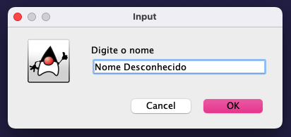
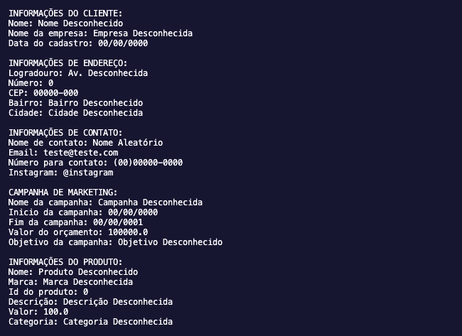

# README - Projeto Salesforce

## Finalidade:

O projeto Salesforce tem como finalidade criar uma aplicação que demonstre a coleta e exibição de informações sobre produtos, campanhas de marketing e clientes. O objetivo é fornecer uma representação realista do uso de objetos e classes em Java, além de demonstrar como essas informações podem ser registradas e posteriormente exibidas.

## Funcionalidades principais:

1. **Cadastro de Produtos:** O programa permite a inserção de informações sobre produtos, incluindo nome, marca, ID, descrição, preço e categoria. 

2. **Cadastro de Campanhas de Marketing:** Os usuários podem registrar informações sobre campanhas de marketing, incluindo nome da campanha, datas de início e término, orçamento e objetivo da campanha.

3. **Cadastro de Clientes:** O programa coleta informações detalhadas do cliente, como nome, nome da empresa, data de cadastro, endereço e informações de contato.

4. **Exibição de Dados:** No final da entrada de informações, o programa exibirá todas as informações registradas para produtos, campanhas e clientes, permitindo que o usuário visualize os dados inseridos.

## Como Executar:

1. Certifique-se de ter o Java instalado em seu sistema.

2. Clone este repositório para o seu computador.

3. Abra o projeto em sua IDE Java de preferência (Eclipse, IntelliJ, etc.).

4. Execute a classe `ExecucaoSistema.java` para iniciar o programa.

5. Siga as instruções exibidas na interface gráfica para inserir as informações.

6. Após concluir o preenchimento dos dados, o programa exibirá todas as informações coletadas.

## Capturas de Tela:

## Desenvolvedores:

- Willian Daniel Olivira Dantas
- João Vitor de Santana dos Santos
- Ryan Azanha

## Referências:

- [Link para recursos ou documentação que você usou, se aplicável]

## Informações Adicionais:

- Qualquer informação relevante sobre o projeto.
