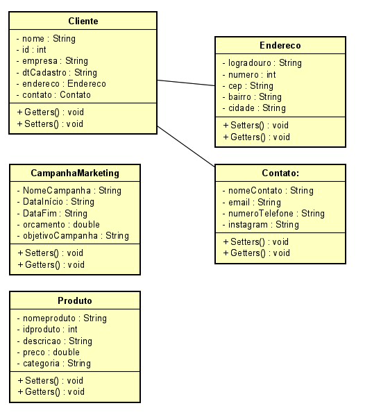

# README - Projeto Salesforce

## Finalidade:

O projeto Salesforce tem como finalidade criar uma aplicação que demonstre a coleta e exibição de informações sobre produtos, campanhas de marketing e clientes. O objetivo é fornecer uma representação realista do uso de objetos e classes em Java, além de demonstrar como essas informações podem ser registradas e posteriormente exibidas.

## Funcionalidades principais:

1. **Cadastrar Funcionário:** Permite o cadastro de informações de funcionários, incluindo nome, email, senha e salário.

2. **Exibir Média de Salários:** Calcula e exibe a média dos salários dos funcionários cadastrados.

3. **Cadastro de Produtos:** O programa permite a inserção de informações sobre produtos, incluindo nome, marca, ID, descrição, preço e categoria. 

4. **Cadastro de Campanhas de Marketing:** Os usuários podem registrar informações sobre campanhas de marketing, incluindo nome da campanha, datas de início e término, orçamento e objetivo da campanha.

5. **Cadastro de Clientes:** O programa coleta informações detalhadas do cliente, como nome, nome da empresa, data de cadastro, endereço e informações de contato.

6. **Exibição de Dados:** No final da entrada de informações, o programa exibirá todas as informações registradas para produtos, campanhas e clientes, permitindo que o usuário visualize os dados inseridos.

## Detalhamento do Processo de Cadastro:
1. **Cadastro de Funcionários:** O programa utiliza um loop do-while para permitir o cadastro de vários funcionários.
A classe Cadastro é instanciada para cada funcionário, e as informações são solicitadas ao usuário usando métodos estáticos texto, inteiro e real.
Cada objeto Cadastro é adicionado a uma lista chamada listaCadastros.

2. **Exibição dos Cadastros de Funcionários:** Após o término do loop de cadastro, o programa exibe os dados de cada funcionário cadastrado usando um loop for-each.
As informações impressas incluem o primeiro nome, sobrenome, ID do usuário, e-mail, senha e salário de cada funcionário.

3. **Cálculo da Média de Salários:** O programa calcula a média dos salários dos funcionários cadastrados e exibe o resultado.

## Armazenamento de Dados:

1. Os dados são armazenados em objetos das classes Cadastro, Cliente, Endereco, Contato, CampanhaMarketing e Produto.
2. As instâncias de Cadastro são armazenadas em uma lista chamada listaCadastros.
3. As instâncias de Endereco e Contato são associadas à instância de Cliente.
4. A instância de CampanhaMarketing é associada à instância de Cliente.
5. A instância de Produto é independente e não está associada diretamente a outras classes.

## Como Executar:

1. Certifique-se de ter o Java instalado em seu sistema.

2. Clone este repositório para o seu computador.

3. Abra o projeto em sua IDE Java de preferência (Eclipse, IntelliJ, etc.).

4. Execute a classe `ExecucaoSistema.java` para iniciar o programa.

5. Siga as instruções exibidas na interface gráfica para inserir as informações.

6. Após concluir o preenchimento dos dados, o programa exibirá todas as informações coletadas.

## Capturas de Tela:

## Diagrama de Classes:

## Desenvolvedores:

- Willian Daniel Olivira Dantas
- João Vitor de Santana dos Santos
- Ryan Azanha da Silva

